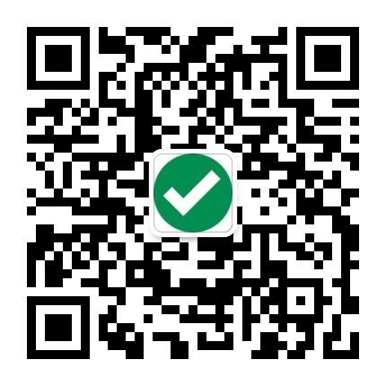

# quant-machine-sp500
[Performance demonstration of S&amp;P500 quant machine (English)](https://yfiua.github.io/quant-machine-sp500/index-en.html)

As of 2023-11 we stop updating as the existing model is outdated. A new model is on the way!

## Backtest
Backtest is carried out from 2011.01 to 2023.02 (inclusive). Summary of the result:

* Annualized return: 20.60%
* Sharpe ratio: 1.06
* Sortino ratio: 2.05
* Calmar ratio: 1.05

Sharpe ratio and Sortino ratio are calculated with risk-free return 0 and geometric means (slightly more conservative than with arithmetic means) based on monthly performance.

## Related
Quant machine for CSI 300 (WeChat account needed):

